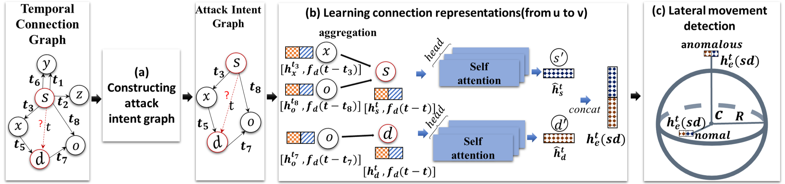

# Detecting Lateral Movement through Graph Analysis with Inter-behavior Intervals Embedding



## Overview

The code implements the methods proposed in the paper and is used to generate the experimental results. Our goal is to effectively detect lateral movement within networks by combining graph analysis with inter-behavior interval embeddings.

  
## Repository Structure

- `data/`: Contains the datasets used in the experiments.
- `construct_AIG/`: Includes the main code implementation, such as data preprocessing, attack intent graph constructing, anomalous correlated graph extracting.
- `model/` and `main.ipynb`: Includes the main code implementation, such as model training, and evaluation scripts.
- `notebooks/`: Contains Jupyter Notebooks for running experiments interactively and visualizing results.
- `results/`: Stores the results generated from experiments, including model outputs and performance metrics.
- `README.md`: This file, providing an overview and instructions for using the project.
- `LBG_env.txt`: Lists the Python packages and dependencies required for the project.

## Requirements

Before running the code, make sure you have installed the following dependencies:

- Python 3.8+
- Additional dependencies listed in the `LBG_env.txt` file.

You can install the dependencies using:

```bash
pip install -r LBG_env.txt
```

## Dataset

Download the public data  
LANL dataset(auth.txt):  
https://csr.lanl.gov/data/cyber1/  
OpTC dataset(ecar-bro):  
https://ieee-dataport.org/open-access/operationally-transparent-cyber-optc  

## Usage

Data Preprocessing  
LANL  run `construct_AIG/LANL_preprocess(TCG)_statistical(TCG and AIG).ipynb`  
OpTC  run `construct_AIG/TCG_OPTC(datapreprocess).ipynb`  

Constructing attack intent graph  
run `construct_AIG/Constructing Attack Intent Graph.ipynb`  

Anomaly detection  
run `main.ipynb`  
